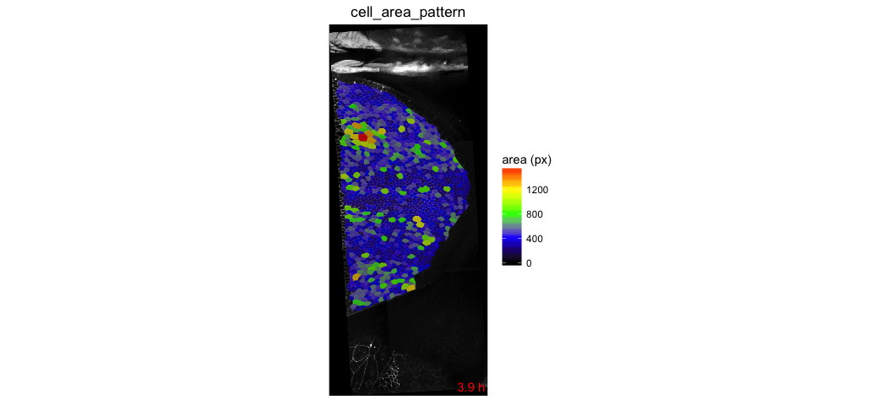
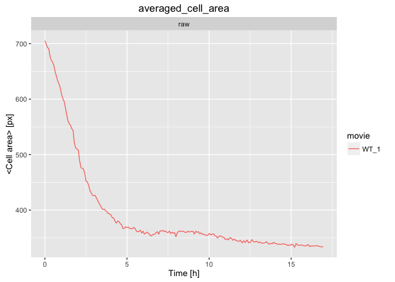
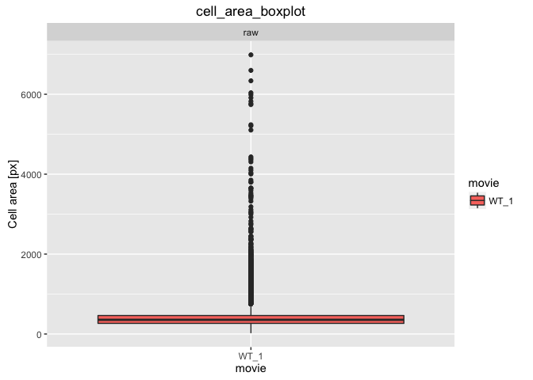

# Cell area analysis

Cell area is stored in the database. It is therefore sufficient to build the database only.


### 1. Make a movie of cell area pattern plotted on the tissue

* Copy-paste the following commands in the terminal:

```
sm make_db 
cell_area_pattern.R . output_analysis
```



[Select another analysis](tm_qs_example_data.md)

### 2. Plot cell area distrubution and averages
* Copy-paste the following commands in the terminal:

```
sm make_db 
cell_area_graphs.R . output_analysis
```



[Select another analysis](tm_qs_example_data.md)

### 3. For further details
* filter by regions of interest, see [Master Guide](https://mpicbg-scicomp.github.io/tissue_miner/tm_tutorial/R-tutorial.html#plot-the-color-coded-cell-area-pattern-in-the-whole_tissue-roi)
* compare multiple movies and ROI's, see [Master Guide](https://mpicbg-scicomp.github.io/tissue_miner/tm_tutorial/R-tutorial.html#comparing-averaged-quantities-between-movies-and-rois)
