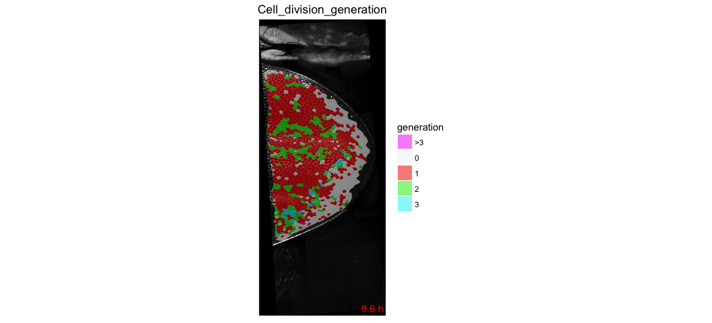
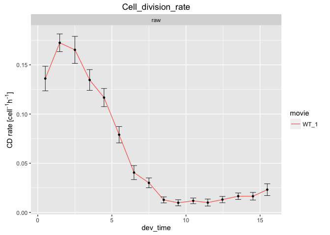
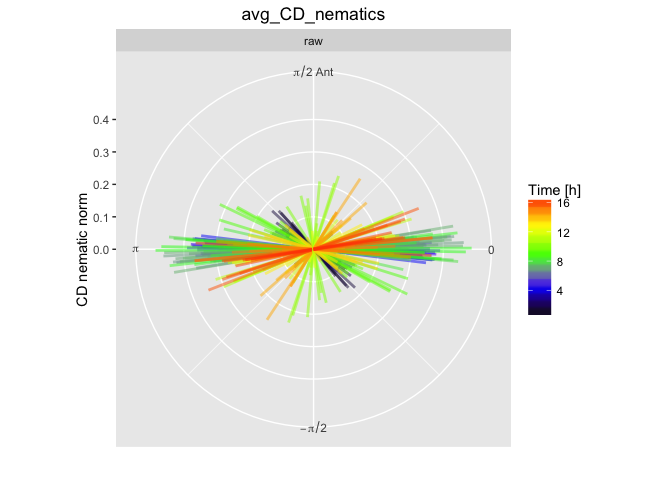

# Cell lineage and division analysis

Cell lineages and cell divisions are stored in the database. It is therefore sufficient to build the database only.


### 1. Make a video of the cumulative pattern of cell divisions plotted on the tissue

* Copy-paste the following commands in the terminal:

```
sm make_db 
cell_division_generation_pattern.R . output_analysis
```



[Select another analysis](tm_qs_example_data.md)

### 2. Make a video of coarse-grained cell division nematics plotted on the tissue

* Copy-paste the following commands in the terminal:

```
sm make_db 
cell_division_orientation_pattern.R . output_analysis
```


[Select another analysis](tm_qs_example_data.md)


### 3. Plot cell division rate
* Copy-paste the following commands in the terminal:

```
sm make_db 
cell_division_rate.R . output_analysis
```



[Select another analysis](tm_qs_example_data.md)

### 4. Plot average cell division orientation as a function of time
* Copy-paste the following commands in the terminal:

```
sm make_db 
cell_division_orientation.R . output_analysis
```



[Select another analysis](tm_qs_example_data.md)

### 5. For further details
* filter by regions of interest, see [Master Guide](https://mpicbg-scicomp.github.io/tissue_miner/tm_tutorial/R-tutorial.html#plot-the-color-coded-cell-area-pattern-in-the-whole_tissue-roi)
* compare multiple movies and ROI's, see [Master Guide](https://mpicbg-scicomp.github.io/tissue_miner/tm_tutorial/R-tutorial.html#comparing-averaged-quantities-between-movies-and-rois)
