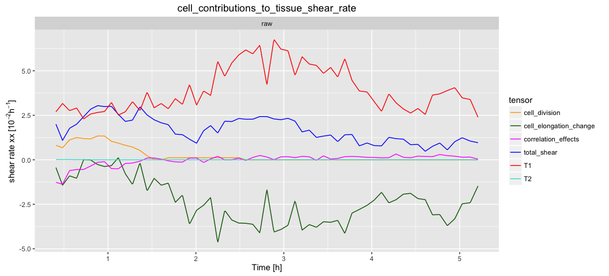

# Cell contributions to tissue shear analysis

### 1. Plot the rate of tissue shear and its cellular contributions

To plot cellular contributions to shear (change in aspect-ratio or pure shear), we need a database, but we also need to run the `tm sm shear_calculate` command, which will take information from the database and calculate shear (using a routine that is included in the automated workflow). Of note, the `tm sm shear_calculate` command will also build the database if not yet present. The next command on the right pools the calculated data and makes the plot we want. It outputs the data in the output_analysis folder within the same movie directory.

* Copy-paste the following commands in the terminal:

```
tm sm shear_calculate; tm cell_contributions_to_tissue_shear_rate.R . output_analysis
```



[Where to find the results ?](../tm_qs_example_data.md#4-look-at-the-results) **|** 
[Back to tutorial list](../tm_qs_example_data.md#3-select-the-analysis-you-are-interested-in)


### 2. Make videos of shear patterns

Shear pattern videos are better generated in the automated workflow. Just typing in the `sm shear_movies` command is sufficient.

* Copy-paste the following commands in the terminal:

```
tm sm shear_movies
```

* Find the videos

Open your file browser and go to the movie directory, in which you should click on the "nematics_movies" folder that contains videos of cell shear contribution pattern.

[Back to tutorial list](../tm_qs_example_data.md#3-select-the-analysis-you-are-interested-in)


### 3. For further details

* compare multiple movies and ROI's, see [TM R User Manual](https://mpicbg-scicomp.github.io/tissue_miner/user_manual/TM_R-UserManual.html#comparing-averaged-quantities-between-movies-and-rois)
