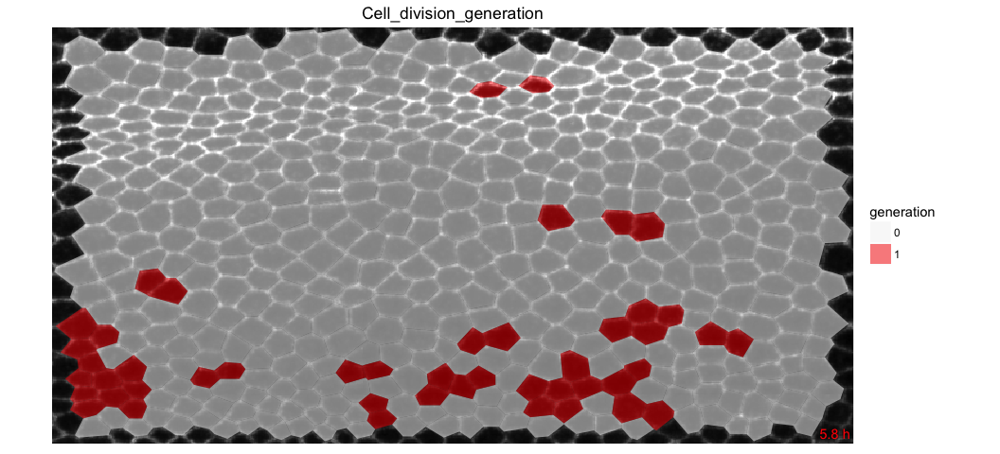
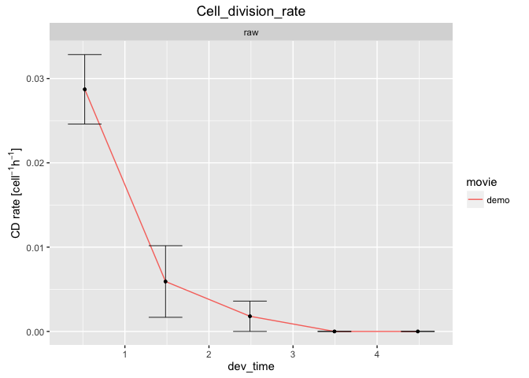
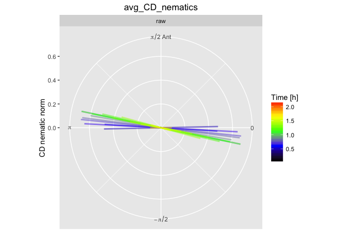

# Cell lineage and division analysis

### 1. Make a video of the cumulative pattern of cell divisions plotted on the tissue

We want to colour code the movie by cell generation. The `tm sm make_db` command will first build a database from the segmented data (or return "Nothing to be done" if the database is present). The next command on the right will run the cell generation analysis and make the video we want. It takes the current movie directory `.` as an input and it outputs the results in the `output_analysis` folder within the same movie directory.

* Copy-paste the following commands in the terminal:

```
tm sm make_db; tm cell_division_generation_pattern.R . output_analysis
```



[Where to find the results ?](../tm_qs_example_data.md#4-look-at-the-results) **|** 
[Back to tutorial list](../tm_qs_example_data.md#3-select-the-analysis-you-are-interested-in)

### 2. Make a video of coarse-grained cell division nematics plotted on the tissue

We want to calculate the coarse-grained orientation of cell divisions, _e.g_ averaged in each element of a square grid, and we want to overlay the orientation axes (unit nematics) on the tissue. The `tm sm make_db` command will first build a database from the segmented data (or return "Nothing to be done" if the database is already present). The next command then runs the cell division orientation analysis and makes the video we want. It takes the current movie directory `.` as an input and it outputs the results in the `output_analysis` folder within the same movie directory.


* Copy-paste the following commands in the terminal:

```
tm sm make_db; tm cell_division_orientation_pattern.R . output_analysis
```


[Where to find the results ?](../tm_qs_example_data.md#4-look-at-the-results) **|** 
[Back to tutorial list](../tm_qs_example_data.md#3-select-the-analysis-you-are-interested-in)


### 3. Plot cell division rate

Now, we want to make a graph that shows the average division rate per cell. The `tm sm make_db` command builds the database if not yet present (or returns "Nothing to be done" if the database is present). The next command does the plot. It takes the current movie directory `.` as an input and it outputs the results in the `output_analysis` folder within the same movie directory.

* Copy-paste the following commands in the terminal:

```
tm sm make_db; tm cell_division_rate.R . output_analysis
```



[Where to find the results ?](../tm_qs_example_data.md#4-look-at-the-results) **|** 
[Back to tutorial list](../tm_qs_example_data.md#3-select-the-analysis-you-are-interested-in)

### 4. Plot average cell division orientation as a function of time

We now want to plot the average division orientation as a function of time in a circular diagram. The `tm sm make_db` command builds the database if not yet present (or returns "Nothing to be done" if the database is present). The next command does the plot. The time is color coded. It takes the current movie directory `.` as an input and it outputs the results in the `output_analysis` folder within the same movie directory.

* Copy-paste the following commands in the terminal:

```
tm sm make_db; tm cell_division_orientation.R . output_analysis
```



[Where to find the results ?](../tm_qs_example_data.md#4-look-at-the-results) **|** 
[Back to tutorial list](../tm_qs_example_data.md#3-select-the-analysis-you-are-interested-in)

### 5. For further details

* compare multiple movies and ROI's, see [TM R User Manual](https://mpicbg-scicomp.github.io/tissue_miner/user_manual/TM_R-UserManual.html#comparing-averaged-quantities-between-movies-and-rois)
